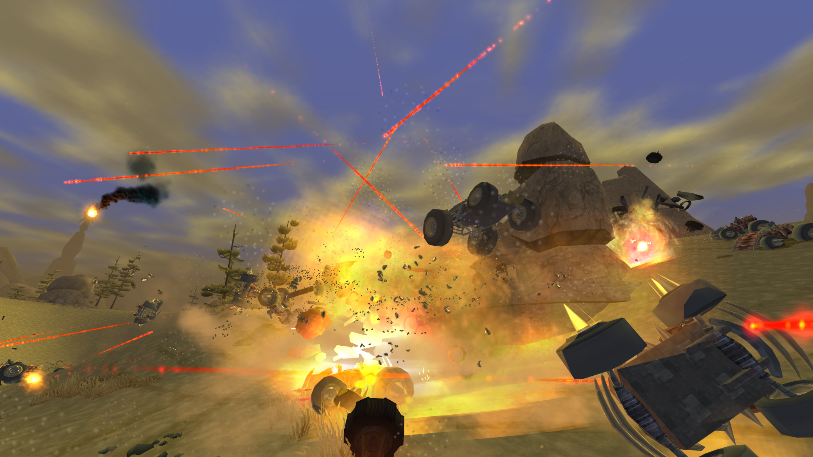
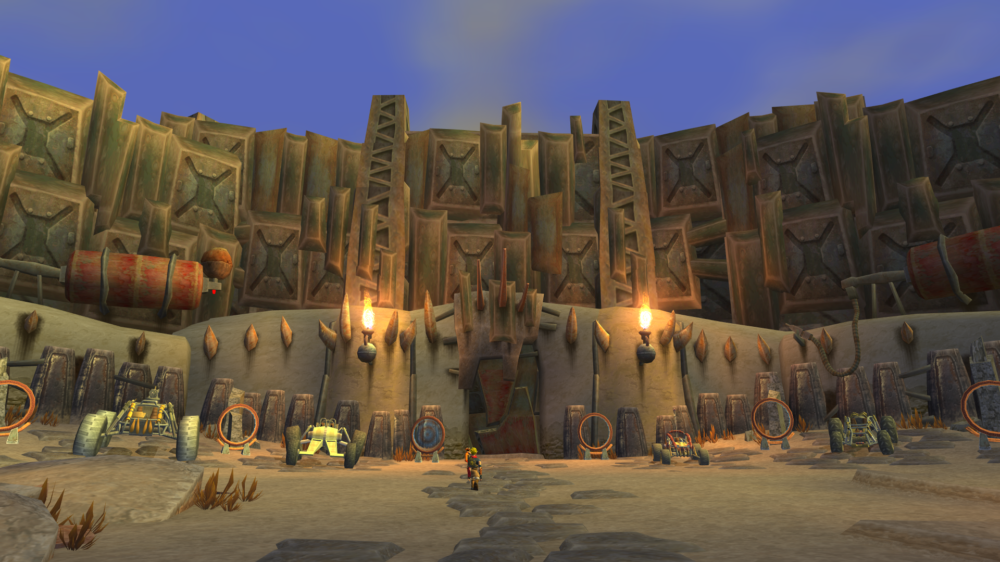
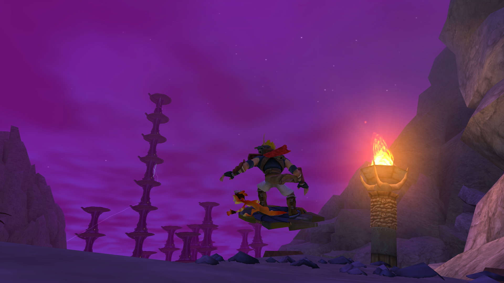
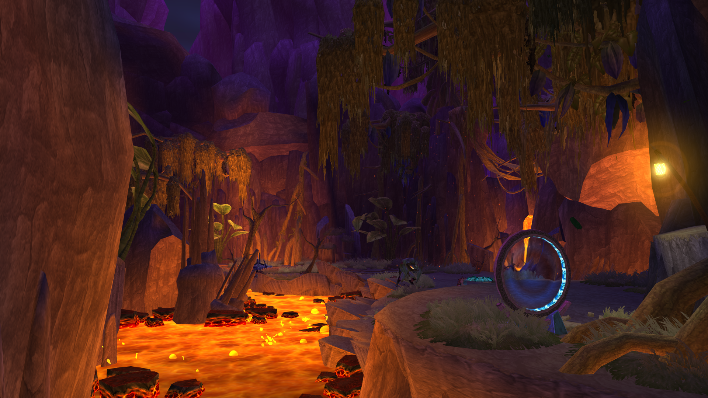
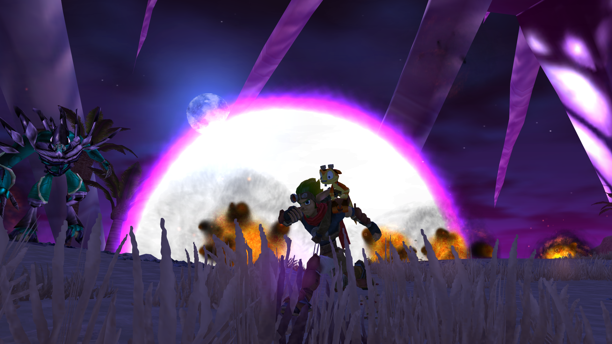
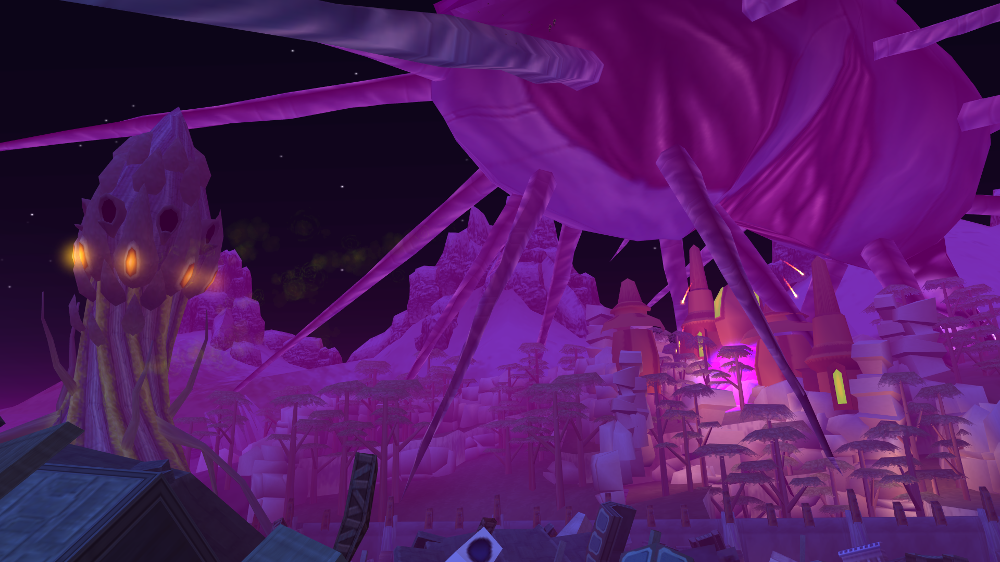

# Jak 3 HeroMode+
Similar to the Jak II HeroMode+ mod, this mod adds a whole new set of mechanics to completely overhaul the gameplay of Jak 3.

After a year of development, I can surely say that this mod is one of the biggest and craziest that I've ever made, hands down. There is so much to cover, so not all changes are listed here. But I will do my best to list all of them here :)

## Leveling System

The mod is designed with a skill-based leveling system for Jak's Guns, Vehicles, and his overall Hero Level.
#### Leveling Hero Level

- Increases HP, Eco containers, and Melee Damage. Guns and Vehicles can also be affected at higher levels. Slaying enemies and completing missions gains experience in this field.
#### Leveling Guns

- Increases damage on projectiles fired by Jak. Depleting ammo will gain experience in this field.
#### Leveling Vehicles

- Enhances certain fire times of a vehicle weapon, increases armor, and a bigger boost tank each level. Slaying enemies/destorying cars **while on a vehicle** will gain experience in this field.
#### Skills

When Jak levels up his Guns, Vehicle, or Hero Level, he gains advantages pertaining to the skill. These are unlocked and useable automatically, rather than chosen with skill points.
## Storyline

Starting from an easter egg found in Jak II's HeroMode+, and continued from the end of Roguelike Jak II, this mod's story comes to it's climax in an epic conclusion. The story is progressed through the main missions of the game, and requires the player to traverse through the dark eco realm: a void and desolate dimension where no one but the dark precursors exist. You and Vin tag team to find and collect Dark Eco Crystals across the dimensions, in order to find and destroy The Entity, which threatens existence itself.
## Weapon Additions & Super Gun Mods

Weapons are not obtained by regular means anymore. At the very start, you get the Scattergun and Blaster mods as usual, but all of the rest are either found via crates dropped by enemies, or by completing certain story missions/optional tasks. They can also be bought in the Black Market, mentioned further down.
#### Super Gun Mods

There are 3 extra mods for each colored gun, making a total of 12 super gun mods to obtain. All three can be activated at the same time for each color. For example, Big shot is a red gun mod, and only affect the 3 red guns. These items are exceptionally rare and make your weapon completely overpowered.

#### Red
- Big Shot: Shots are bigger and have more AOE
- Commando Shot: Shoot out 3 blaster mod projectiles in a wide range
- Quad Shot: Shots quadruple to fire out in all directions
#### Yellow
- Catapult Fury: Every shot sends a fireball down to strike your enemy
- Silver Freeze: Every shot freezes an enemy for 0.5 seconds
- Critical Shot: Chance to crit enemies for absolute massive damage.
#### Blue
- Ammo Shark: 33.33% chance to not consume ammo while firing
- Minigun Shot: Fire a purple turret shot that does extra damage
- Master Blaster: Chance for a purple turret shot to fire out from Jak in all directions
#### Dark (NONE OF THESE WORK WITH THE NUKE, FOR OBVIOUS REASONS)
- Random Shot: Shoot out a few random projectiles when firing
- Reaper: Fire a purple rift that lobs grenades at all your foes
- Multi-Burst: Shoot out more than one shot while only consuming one ammo.
## Wasteland Warp Room

Inside of the vehicle selection room in the wasteland, you'll find several warp gates going to different places. 

#### Dark Eco Realm
One of these goes to the Dark Eco Realm, a desolate world filled with high-level enemies of unknown value. There are 8 Satellites scattered around in the wasteland area, each one being more and more difficult as you destroy them. A dark forest is present nearby the enterance. One of them, a large tower, looks to be the center of all the power in the dimension. It towers so high up, it can be seen from mostly anywhere in the wasteland. Cyber Vin is also present here, and you can talk to him to either progress the story, or purchase things from the black market with Dark Eco Crystals.

#### Dark Volcano
The first area you cannot backtrack to after completing it's mission, the volcano area can be accessed to level off of the enemies there. Their levels range from 11-18 each time you traverse through the warp gate. There are two mini-bosses found here. One of them being General Gouge, a bigger mantis that hops around and cannot be knocked back. The other is named Steamroller, which is a giant spiky frog that rolls around.

#### Dark Eco Mine
The second area you cannot backtrack to after completing it's mission, the eco mine can be accessed through the warp room to farm off of enemies. You can also replay the precursor robot bossfight for extra rewards and XP, but be warned: It has several new attacks and is much more difficult than the first precursor robot.

#### Dark War Factory
The third area you cannot backtrack to, but can access it through the warp gate. At the moment, the boss in this area is not replayable (nor do I plan to make it replayable, either). There are several enemies to farm off of here, as they are all leveled towards the 60-80 region. There's also an area where you can go out and explore the outer war factory on foot, but there aren't any enemies around.
## Replayable Arenas

Similar to Ratchet and Clank, there are a series of challenges with increasingly better rewards as they get more and more difficult. All three arenas can be replayed to an infinite time. Additionally, there is also a new arena called THE DEATH DOME, which is all three arenas at the same time. There's a timer indicating how much time has passed, and how many marauders have been killed. When the timer reaches 3 Minutes and 25 Seconds, Arena Events will occur, which starts a random event that affects the whole arena. As time goes by, the Marauders will increasingly gain levels infinitely.
## Custom/Remixed Missions

Mostly all missions have either been altered, redone, or completely replaced by custom missions. Most of these missions were altered or replaced because they did not give the gameplay of Jak and Daxter any justice (like the turret mission). All of these changes are done to make the game either more difficult (HeroMode+), or to be *difficult enough* so you can have room to level up your character.
## Loot Drop System

Enemies have a chance to drop loot crates upon death. These crates vary from Tier 1-3.

#### Tier 1 (Urn)
This drop is the most common, it carries mostly ammo and sometimes 1-3 metal head skull gems.

#### Tier 2 (Blue Krimzon Crate)
This drop is uncommon, and Jak's Hero Level must at least be at 7. They drop a grand amount of ammo, dark eco, and 6-12 skull gems, and sometimes a dark eco crystal. Very *very* rarely it will drop a weapon. There is an extremely small chance to also get a super gun mod from this crate as well.

#### Tier 3 (Black Krimzon Crate)
This drop is the rarest, it only drops after Jak's Hero Level reaches past 18. They drop a huge amount of skull gems, dark eco crystals, and weapons. Sometimes it will drop a super gun mod.
## Vin's Black Market
In the Dark Eco Realm, inside of the vehicle selection room, you will find Vin's floating head. When talking with him, you can purchase rewards with Dark Eco Crystals you collect throughout the mod's drop systems. Vin also states that he needs Dark Eco Crystals to research, and in doing so, progresses the mod's storyline.

## Dark Maker Ships

The Dark Maker Ship is a random event that occurs when the player's level is past level 18, and will sit stationary in either a certain part of the wasteland, or in Haven City. Upon getting close, the event activates and fireballs rain down from the huge ship above. Dark Precursors will spawn in waves, and in some waves, a giant Dark Precursor MiniBoss will spawn to lob the player with 5-6 dark eco grenades. Completing this event makes the ship disappear and drops a group of crates, and a really good chance of obtaining a weapon.

## Satellite Fights

Don't you wish you could fight the Dark Precursor Satellite more than just once? In this mod, you can fight it in it's respective mission, but then also go into the dark eco world and fight it 8 more times in different parts of the wasteland. The Satellite's attack patterns have been altered, and each satellite you fight increasingly gets more and more difficult--with greater varying rewards.
## Enemy Respawn Locations

Some areas have places for enemies to respawn over and over, for farming purposes. One said example is the Temple, where in the room with mar's door, a Dark Precursor Titan will spawn if no mission is active. Other areas include the dark eco world, and some of the warp gate areas as well.
## Fast Travel

From the HeroMode+ Mod Menu, you can fast travel to some locations if you have them discovered already.
## Altered HP, Dark, and Light Eco bars

Since Jak levels up and those containers gradually increase, the HP HUD on the bottom left has been redone into 3 bars. Additionally, enemies also have a HUD when attacked, indicating their name, level, and current HP. Each enemy's health bar has drastically increased HP depending on their current level.
## Damage Outputs

The way the game handles damage now is different. Since Jak can have greatly increased HP, the damage outputs are also different based off of the enemy's level. Receiving damage from enemies is the lowest when your Hero Level is 3 or more above the enemy's. Damage is increased from the enemy the higher the level it is from your Hero Level. When the enemy is 3 levels or more above yours, the enemy's level will appear red on the HP Bar. Finally, if the enemy's level is 7 levels or more above your Hero Level, the enemy's damage has the capacity to one-shot kill--so be careful treading into areas where this is the case!
